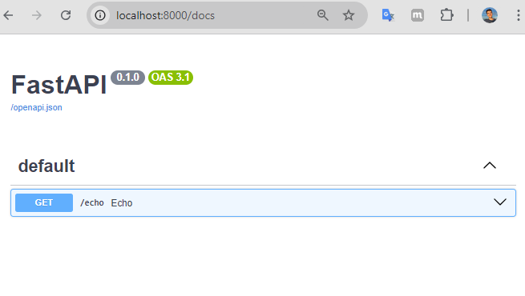

## Server side
In the main.py directory, run the command below to start the server:
```
$ uvicorn main:app --reload
```

## Client side
### Docs
If you want to get more detail about the available paths, you can use the `/docs`.


### To test:
Run the command:
```
$ curl -v -X GET http://localhost:8000/echo | jq
```

Expected output (example):
```
> GET /echo HTTP/1.1
> Host: localhost:8000
> User-Agent: curl/7.81.0
> Accept: */*
>
* Mark bundle as not supporting multiuse
< HTTP/1.1 200 OK
< date: Sat, 03 Aug 2024 14:48:56 GMT
< server: uvicorn
< content-length: 213
< content-type: application/json
<
{ [213 bytes data]
100   213  100   213    0     0  83138      0 --:--:-- --:--:-- --:--:--  104k
* Connection #0 to host localhost left intact
{
  "url": "http://localhost:8000/echo",
  "headers": "Headers({'host': 'localhost:8000', 'user-agent': 'curl/7.81.0', 'accept': '*/*'})",
  "client": "Address(host='127.0.0.1', port=60928)",
  "date": "08/03/24-11:48:57"
}
```

